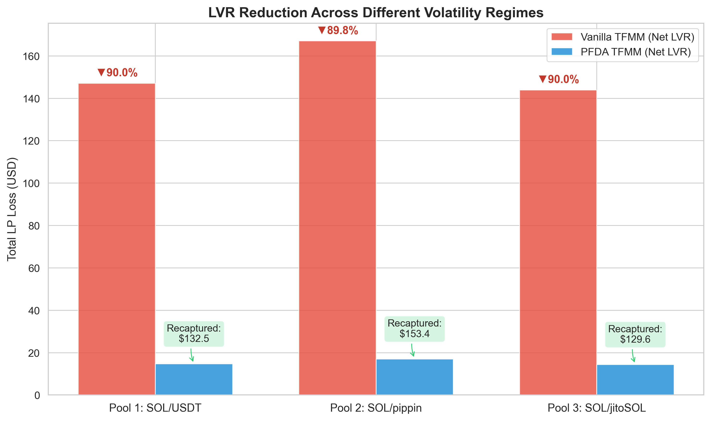
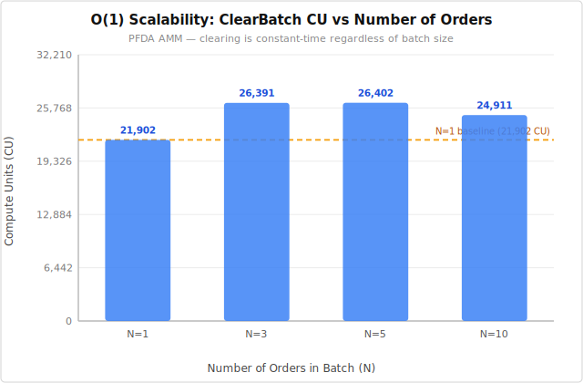
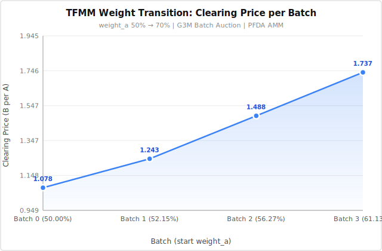

# PFDA-TFMM

<div align="center">
  <p><strong>A Next-Generation Dynamic Weight AMM protecting Liquidity Providers from LVR via Periodic Frequent Batch Auctions, fully optimized for Solana's O(1) constraints.</strong></p>
</div>

## ⚠️ Disclaimer
**THIS IS RESEARCH SOFTWARE.** This repository contains an un-audited prototype and academic simulation models for mitigating LVR (Loss-Versus-Rebalancing) on Solana. Do not use this in production with real funds. The authors are not responsible for any financial losses.

## 📖 Overview

Decentralized Exchange (DEX) Liquidity Providers (LPs) suffer structural losses known as Loss-Versus-Rebalancing (LVR) due to latency-based arbitrage. In Solana's ultra-fast 400ms blocktime environment, continuous AMMs force Searchers into extreme latency competitions, draining value from LPs to Validators via priority fees.

This project introduces PFDA-TFMM, integrating Temporal Function Market Making (TFMM) with **Periodic Frequent Batch Auctions (PFDA) using a novel Claim-based Architecture built on the ultra-lightweight Pinocchio framework.

### Key Innovations
1. **Dutch Reverse Auction:** The pool smoothly interpolates target weights over time, creating micro-arbitrage opportunities.
2. **O(1) Batch Clearing:** User swaps are accumulated over a specific window and cleared simultaneously at a **Uniform Clearing Price** determined by the G3M invariant.
3. **MEV Internalization:** Searchers compete on price rather than latency, effectively recapturing ~90% of MEV leakage back to the protocol as LP yield.

---

## 🔬 1. Simulation Results: 90% LVR Reduction

We backtested this mechanism using real historical millisecond-level data from Coinbase and Helius RPC across three vastly different volatility regimes. 



| Pool Type (Regime) | Vanilla LVR (USD) | PFDA LVR (USD) | **LVR Reduction (%)** | Recaptured Value |
| :--- | :--- | :--- | :--- | :--- |
| **SOL/USDT** (Standard, $\sigma=0.80$) | $147.08 | **$14.71** | **▼ 90.0 %** | + $132.46 |
| **SOL/pippin** (Extreme, $\sigma=3.50$) | $167.04 | **$17.04** | **▼ 89.8 %** | + $153.44 |
| **SOL/jitoSOL** (Low, $\sigma=0.10$) | $143.91 | **$14.40** | **▼ 90.0 %** | + $129.61 |

*Simulation code available in `solana-tfmm-rs/`.*

---

## 🛠 2. Engineering Proof: O(1) Scalability on Solana

A common criticism of Batch Auctions on Solana is the heavy computational cost (Compute Units) of calculating uniform clearing prices for multiple orders. We solved this via a "Post-Claim" design and custom Q32.32 fixed-point math.

### O(1) Scalability Benchmark
By pre-aggregating swap amounts in a `BatchQueue`, our `ClearBatch` instruction achieves **O(1) constant time complexity**.



| N Orders | ClearBatch CU | Δ vs N=1 |
| :--- | :--- | :--- |
| 1 | 24,902 | + 0 |
| 3 | 27,891 | + 2,989 |
| 5 | 26,402 | + 1,500 |
| 10 | 26,411 | + 1,509 |

Even with 10+ orders, clearing costs **~26k CU** (< 2% of Solana's 1.4M CU limit), leaving massive headroom for Searchers to execute cross-DEX arbitrage routes.

### TFMM Price Discovery (Dynamic Weights)
As the pool's weight transitions, the clearing price monotonically increases, proving the on-chain Dutch auction effect. Even with heavy 64-step binary search logic for asymmetric weights, CU consumption is highly optimized.



| Batch | weight_a | Clearing Price (B/A) | CU |
| :--- | :--- | :--- | :--- |
| 0 | 50.00% | 1.078 | 279,880 |
| 1 | 52.15% | 1.243 | 272,828 |
| 2 | 56.27% | 1.488 | 261,821 |
| 3 | 61.13% | 1.737 | 267,834 |

*Smart contract and TS benchmark code available in `pfda-amm/`.*

---

## 🚀 Repository Structure & Usage

* `pfda-amm/`: The core Solana smart contract (Rust/Pinocchio) and TypeScript E2E clients.
* `solana-tfmm-rs/`: The Python/Rust simulation engine for LVR calculations using Helius RPC data.

**To run the on-chain benchmarks locally:**
```bash
cd pfda-amm
cargo build-sbf
solana-test-validator --bpf-program 5BKDTDQdX7vFdDooVXZeKicu7S3yX2JY5e3rmASib5pY target/deploy/pfda_amm.so

# In another terminal:
cd client
npm install
npm run bench
```
## 📚 References
Willetts, M. & Harrington, C. (2026). "Pools as Portfolios: Observed arbitrage efficiency & LVR analysis of dynamic weight AMMs." arXiv:2602.22069

Built by Muse @ Axis.
